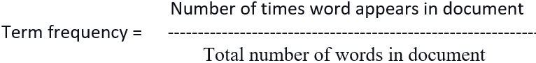
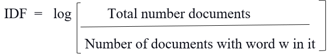
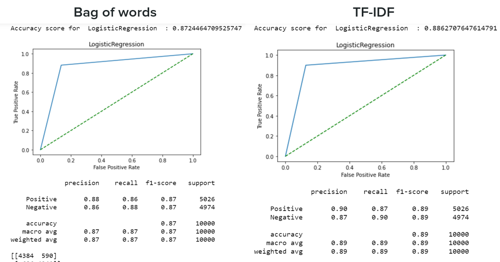
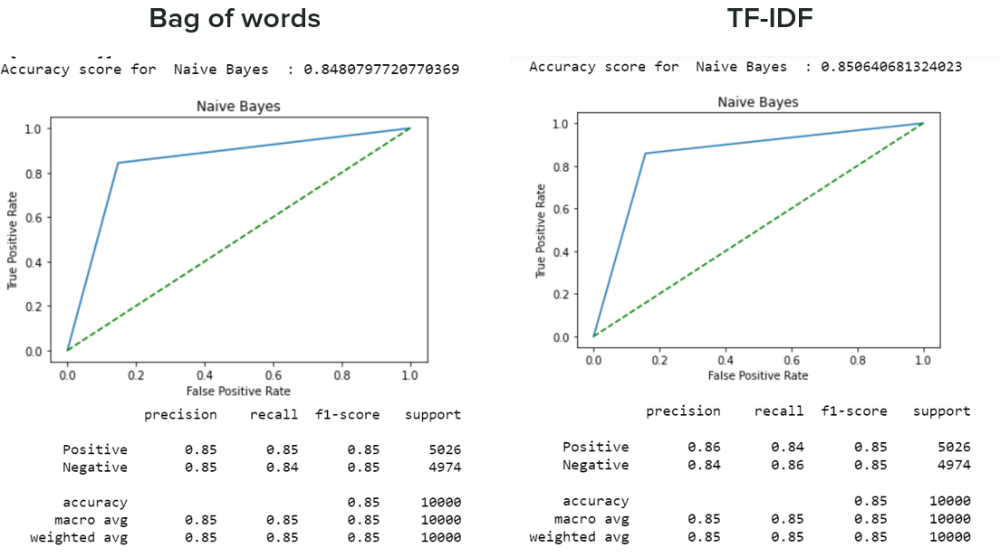
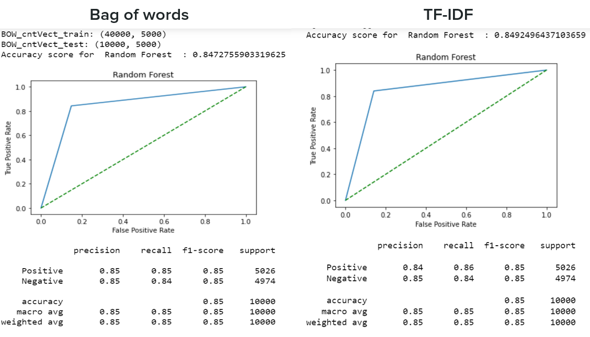
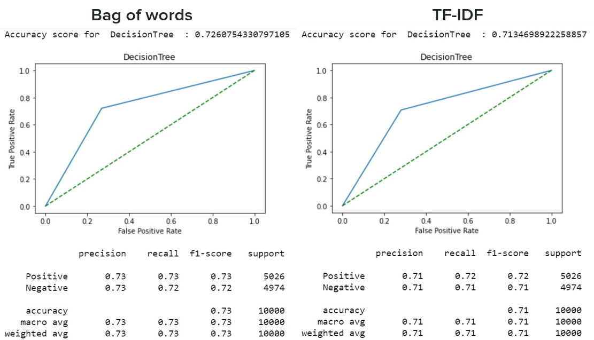
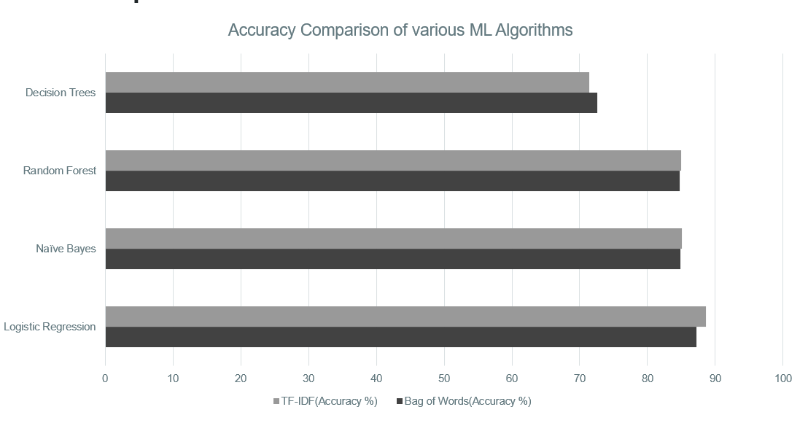
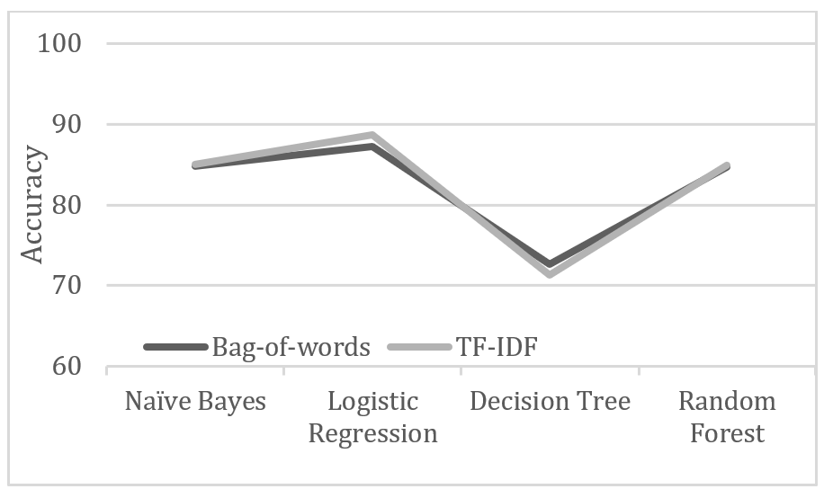
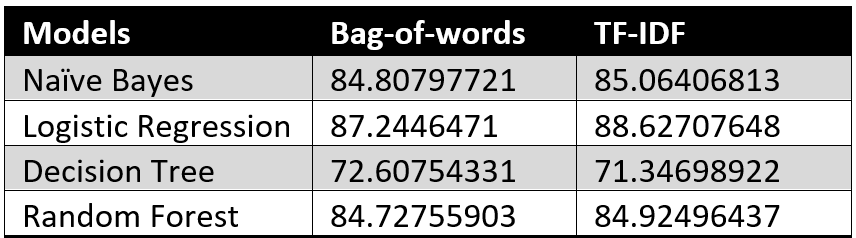

# Sentiment Analysis on IMDB Dataset

## **Description:**

The dataset we used contains a collection of 50,000 movie reviews from IMDB. This dataset is split fairly, with 25k reviews designed for training and 25k for testing with classifiers. Besides, each set has 12.5k positive and 12.5k negative reviews. 
Here we are going to predict the sentiment of a new review by performing feature extraction along with various classifiers with the highest accuracy- Machine Learning model and use these features to train our multilabel classifier to classify the movie review into its correct label. It can help to determine the attitude of the reviewer concerning various topics or the overall polarity of review.
In such humongous data, we cannot directly run our algorithms. This data content is messy, and people love to throw in efforts to express themselves more precisely by attaching exaggerated punctuation and misspell words. So in our Review 2 the 2nd Iteration we brought them in to the format required to process our algorithm efficiently. That is the pre-processing of data set.
In this iteration, we implemented 2 methods that is bag of words and TF-IDF for the extraction of essential features from the pre-processed review text. This resulted data is further used for training purposes. These features were then used for training different classifiers like Logistic regression and Naïve Bayes.

## **Implementation:**

## 1.	**Data Cleaning and Preprocessing**
*	***Extracting and merging data:***  each review is present in individual text files. We read every file present in both negative and positive for the training folder in a list by looping through all the files and appending content of every file in the same list variable.
*	***Special Character removal:*** Digits, punctuation and special characters don’t communicate any sentiment and can be excluded.
*	***Conversion of reviews to lower case:*** In case the data has capital letters, turning to lowercase will simplify things.
*	***HTML character removal:*** The data contains all the HTML formats and tags. So we removed all the HTML related characters, which has no relation with the reviews semantic. It left us with the strings related to the review with no extra characters.
*	***Stop word removal:*** These are widespread words like “he,” she,” if,” etc. These words can be removed without changing the semantics to increase the performance of the model that will be implemented further.
*	***Stemming:*** Stemming is the process of replacing words with their root word. word. Such as ‘connecting’, ‘conected’ and ‘connection’ all have the root ‘connect’.

## 2. **Feature Extraction**

  Once the preprocessing is done, the subsequent step was analyzing the reviews to find common perceptible patterns that may influence the duality of the data. For determining the text polarity, it is crucial to note that the sentiment score may be intensified or declined with its usage as well as their involvement with the nearby words. Those enabled us to analyze features that influence the polarity of the data and are as follows:

1. **Bag of Words:**

  It keeps a count of the total occurrences of most frequently used words. First, we created a vocabulary list of all the unique words occurring in all the documents in the training set. Then created a matrix of training features containing term frequencies for every word in each record.
  It is called the bag-of-words approach since the number of occurrences and not sequence or order of words matters in this approach.

2. **TF-IDF:**

  This stands for Term-frequency-Inverse-Document-Frequency. It gives the relative important a word is in the document which, in this case, is a review, in the dataset.

 

  Inverse document frequency estimates how rare a term is across all documents (the higher the value, the rarer the word). It helps compare the rate of the word in a review with how many times it appears in
  all other reviews in the dataset.

  

  We combined these two by multiplying to determine Tf-Idf =  TF* IDF
  Here instead of vectors with discrete counts alike BoW, the transformed vector now comprises continuous in value.
  We use the Tfidf transformer() which is in sklearn’s library.
  Fitting is done on the training set, and determined the values for the same words for the test set.

## 3. **Machine learning models**
 1. **Logistic regression Using Bag of words and TF-IDF:**
 
Logistic regression is a form of predictive modeling procedure that investigates the relationship among a dependent (target) and the independent variable (predictor). It is employed to predict the outcome of the categorical dependent variable, and the result is discrete either 0 or 1, True or False. We used LogisticRegression() function to train the model. 
It formerly Fitted the model for the bag of words. Later fitted the model for tf-idf features. After it is fitted for both of the feature extraction routines. The model prediction is done for the bag of words as well as predicted the model for tf-idf features. Next found out the accuracy score for the bag of words and also determined the accuracy of tf-idf features. Later we have calculated the precision, recall, F1, and support ratings for the model for the bag of words and tf-idf. Devised a confusion matrix for the bag of words and built a confusion matrix for tf-idf features for further analysis to gain significant accuracy.
 Output:
    

  2. **Naïve Bayes Using Bag of words and TF-IDF:**
  
It is an extension of the Naïve Bayes classification algorithm and is based on the Bayes’ theorem. Bayes’ theorem mainly describes the probability of an event based on prior experience. It gives the probability of an event based on a Condition. We have used Multinomial Naïve Bayes.
We have trained the model using MultinomialNB() function, and formerly Fitted the model for the bag of words. Later fitted the model for tf-idf features. After it is fitted for both of the feature extraction routines, the model prediction is done for the bag of words as well as predicted the model for tf-idf features. Next found out the accuracy score for the bag of words and also determined the accuracy of tf-idf features. Later we have calculated the precision, recall, F1, and support ratings for the model for the bag of words and tf-idf. Devised a confusion matrix for the bag of words and built a confusion matrix for tf-idf features for further analysis to gain significant accuracy.
Output:
			
 3. **Random Forest Using Bag of words and TF-IDF:**
 
The random forest is a supervised learning algorithm that randomly creates and consolidates multiple decision trees into one “forest.” It is an ensemble tree-based training algorithm. This means it merges more than one algorithms of the identical or different character for grouping objects. A collection of decision trees of a randomly selected subset of the training set. It aggregates the choices from many decision trees to determine the final class of the test data. The goal is not to rely on a single learning model, but rather a set of decision models to improve accuracy. A total of 100 estimators were used by us for the Random Forest Classifier here. The number of estimators can be changed to determine how many trees you need in a forest. The data, as in the other classifiers, is classified into positive and negative. We have trained the model using the Classifier () function we built, formerly Fitted the model for the bag of words and tf-idf features, and created a ROC curve. Predicted the model for the bag of words and tf-idf features. Later found out the accuracy score for the bag of words and tf-idf features. Displays the precision, recall, F1, and support scores for the model using the Classification report() function for the bag of words and tf-idf. Then created a confusion matrix for the bag of words and tf-idf features.
Output:			
			
 4. **Decision Tress Using Bag of words and TF-IDF:**
 
The decision tree is a decision support mechanism that practices a tree-like model of decisions and their potential consequences, including chance event results, resource costs, and utility. Decision trees are generally used in conducting research and procedures management. Another advantage of decision tree is as a descriptive means for computing conditional probabilities. The data, as in the other classifiers, is classified into positive and negative. We have trained the model using Classifier () function we built, formerly Fitted the model for the bag of words and tf-idf features, and created a ROC curve. Predicted the model for the bag of words and tf-idf features. Later found out the accuracy score for the bag of words and tf-idf features. Displays the precision, recall, F1, and support scores for the model using the Classification report() function for the bag of words and tf-idf. Then created a confusion matrix for the bag of words and tf-idf features.
Output:
		

## **Comparison of Models based on Accuracy**

## **Accuracy Table**

